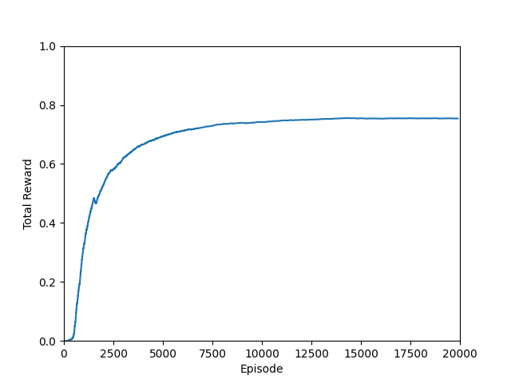
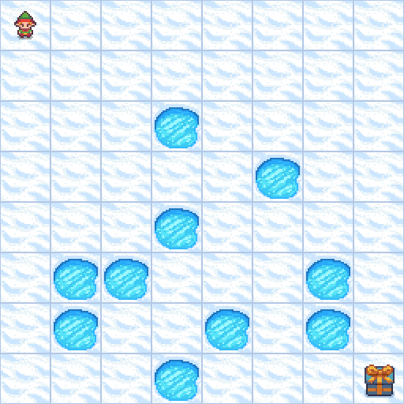
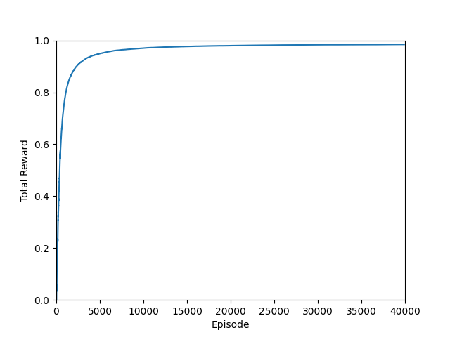
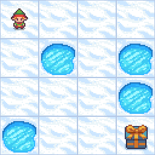

# FrozenLake Q-Learning: Neural Network & Tabular Approaches

This repo demonstrates two implementations of Q-Learning to solve the **FrozenLake** environment from **OpenAI Gymnasium**:
- **Q-Learning with a Neural Network (NN)**  
- **Q-Learning with a Tabular (Q-table)** 

Both implementations explore the agent's learning in environments with and without slippery tiles.

## Q-Learning with Neural Network (frozenlake_q_learn.py)
- Uses **PyTorch** to approximate Q-values with a feedforward neural network.
- Explores and exploits using epsilon-greedy policy.
- Updates network weights via **Mean Squared Error loss**.
- Saves the trained model to `q_table_FrozenLake-v1_8x8_slippery.pth`.
- Generates a graph of cumulative rewards.

# SLIPPERY SURFACE:

## Q-Learning with Tabular Q-Table (frozenlake_non_NN.py)
- Implements classic **Q-learning** with a **Q-table** to store Q-values for each state-action pair.
- Uses epsilon-greedy policy for exploration.
- Saves the Q-table to `q_table_FrozenLake-v1_4x4_not_slippery.npy`.
- Generates a graph of cumulative rewards.

# NON-SLIPPERY SURFACE:

